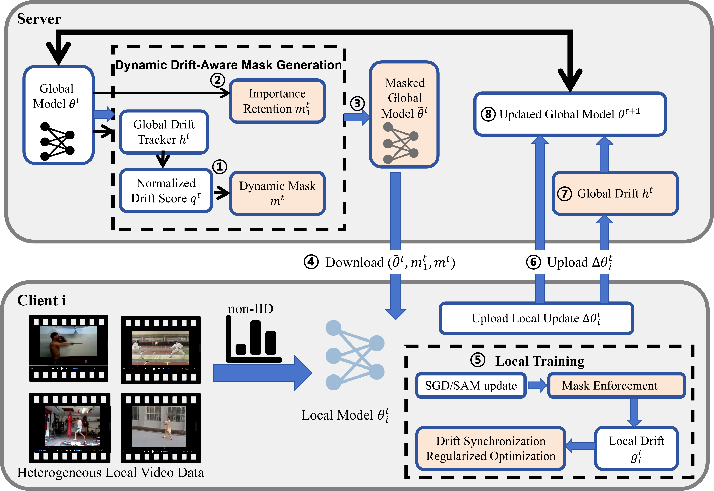

# DADPFed-Code
This repository accompanies the manuscript submitted to *The Visual Computer*.

## Citation
If you use this code in your research, please cite our manuscript:
Zhihao Liu, Wei Guo, Jie Wu, Mengke Zhu, Jiamin Liang.
Drift-Aware Dynamic Pruning: A Stabilising Heuristic for Heterogeneous Federated Action Recognition.
*The Visual Computer*, 2025.

## Permanent Archive
Zenodo DOI (permanent, citable): https://doi.org/10.5281/zenodo.19325591

## Data Note
Raw video data is derived from public benchmarks (Kinetics-MA, UCF101-MA). Due to copyright constraints, raw videos are not included; all subset construction and preprocessing scripts are provided for full reproducibility.

# DADPFed Reproduction in FL-main

This repository now includes a full implementation of the paper method in `method.txt`:

- `DADPFed`
- `DADPFed-SAM`

It is integrated into the existing federated learning framework (`train.py`, `server/`, `client/`) and can run directly on the dataset in `data/`.

## 1. What Was Implemented

### New methods

- Server side:
  - `server/DADPFed.py`
  - `server/DADPFedSAM.py`
- Client side:
  - `client/dadpfed.py`
  - `client/dadpfedsam.py`

### Framework integration

- Added method registry:
  - `server/__init__.py`
  - `client/__init__.py`
  - `train.py` (`--method DADPFed|DADPFedSAM`)
- Added DADPFed hyperparameters in `train.py`:
  - `--dadpfed-cycle` (paper `R`, default `40`)
  - `--dadpfed-retention` (paper `Th`, default `0.75`)
  - `--dadpfed-mask-quantile` (drift mask quantile, default `0.75`)
  - `--momentum` (default `0.9`)
- Added dataset option `--dataset UCF101-MA` in `train.py`.

### Kinetics-MA and UCF101-MA  support

- `dataset.py` already had UCF101-MA preprocessing logic; this work completed training/inference pathway support in `Dataset`.
- First run decodes videos and caches split data to:
  - `./Data/UCF101-MA_<clients>_<seed>_<split_rule>_<split_coef>/`

## 2. Method Mapping to Paper

Implemented core parts from Methodology / Experimental Setup:

- Drift-aware dynamic mask:
  - \( q^t = |h^t| / (|\theta^t| + \epsilon) \)
  - mask by quantile threshold (`--dadpfed-mask-quantile`)
- Importance retention mask:
  - Top-K by \(|\theta^t|\), ratio `Th` (`--dadpfed-retention`)
- Combined masking:
  - \( \tilde{\theta}^t = \theta^t \odot m^t \odot m_1^t \)
- Server drift update:
  - maintains global drift `h`
- Client drift synchronization:
  - maintains per-client drift `g_i`
- DADPFed-SAM:
  - SAM-style two-step local optimization on top of the DADPFed local objective

## 3. Install

```bash
pip install -r requirements.txt
```

## 4. Run Experiments

Scripts are in `scripts/`:

- `scripts/run_dadpfed.sh`
- `scripts/run_dadpfedsam.sh`
- `scripts/run_dadpfed_exp.sh` (shared configurable launcher)

### 4.1 Quick smoke run (already verified)

```bash
COMM_ROUNDS=1 LOCAL_EPOCHS=1 TOTAL_CLIENT=10 ACTIVE_RATIO=0.2 BATCH_SIZE=8 DATASET=UCF101-MA bash scripts/run_dadpfed.sh
COMM_ROUNDS=1 LOCAL_EPOCHS=1 TOTAL_CLIENT=10 ACTIVE_RATIO=0.2 BATCH_SIZE=8 DATASET=UCF101-MA bash scripts/run_dadpfedsam.sh
```

### 4.2 Main reproduction-style setup (paper-like knobs)

```bash
# D1: alpha_d = 0.3, partial participation C = 0.15
DATASET=UCF101-MA METHOD=DADPFed NON_IID=1 SPLIT_COEF=0.3 TOTAL_CLIENT=100 ACTIVE_RATIO=0.15 \
COMM_ROUNDS=1000 LOCAL_EPOCHS=5 DADPFED_CYCLE=40 DADPFED_RETENTION=0.75 \
bash scripts/run_dadpfed_exp.sh
```

```bash
# D2: alpha_d = 0.6
DATASET=UCF101-MA METHOD=DADPFed NON_IID=1 SPLIT_COEF=0.6 TOTAL_CLIENT=100 ACTIVE_RATIO=0.15 \
COMM_ROUNDS=1000 LOCAL_EPOCHS=5 DADPFED_CYCLE=40 DADPFED_RETENTION=0.75 \
bash scripts/run_dadpfed_exp.sh
```

```bash
# IID-like: alpha_d = 100
DATASET=UCF101-MA METHOD=DADPFed NON_IID=1 SPLIT_COEF=100 TOTAL_CLIENT=100 ACTIVE_RATIO=0.15 \
COMM_ROUNDS=1000 LOCAL_EPOCHS=5 DADPFED_CYCLE=40 DADPFED_RETENTION=0.75 \
bash scripts/run_dadpfed_exp.sh
```

### 4.3 Full participation setting

Set:

- `ACTIVE_RATIO=1.0`
- `TOTAL_CLIENT=100`

## 5. Output Files

Training outputs are saved under:

- `out/T=<rounds>/<dataset>-<split_rule><split_coef>-<clients>/active-<ratio>/`

Key files:

- `Performance/trn-<METHOD>.npy`
- `Performance/tst-<METHOD>.npy`
- `Divergence/divergence-<METHOD>.npy`

Example verified output:

- `out/T=1/UCF101-MA-Dirichlet0.3-10/active-0.2/Performance/tst-DADPFed.npy`
- `out/T=1/UCF101-MA-Dirichlet0.3-10/active-0.2/Performance/tst-DADPFedSAM.npy`

## 6. Notes

- In the current framework, UCF101-MA is processed as per-video representative frames for federated training compatibility.
- Hyperparameters can be changed directly at the top of `scripts/run_dadpfed_exp.sh`, or overridden via environment variables.
